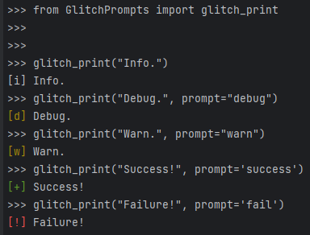

## GlitchPrompts
{{ page.title }}

## Purpose
Used as a quick way to add color and prompts to automation.

###  Example
Basic usage of this module.
```python
from GlitchPrompts import glitch_print

glitch_print("Info.")
glitch_print("Debug.", prompt="debug")
glitch_print("Warn.", prompt="warn")
glitch_print("Success!", prompt='success')
glitch_print("Failure!", prompt='fail')

```

Expected Output:


